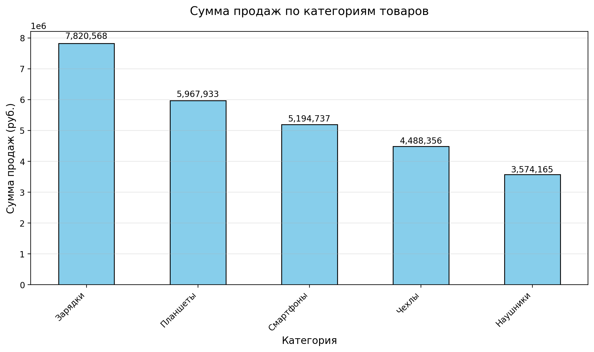
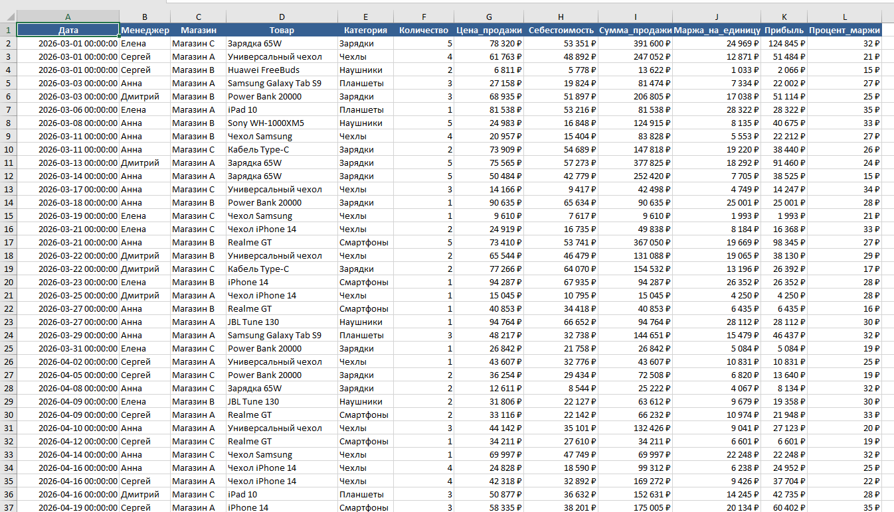

# Автоматизация обработки отчётов продаж

**Python-скрипт** для автоматической обработки еженедельных/ежемесячных отчётов продаж из нескольких Excel-файлов с расчётом финансовых показателей и генерацией аналитического отчёта.

---

## ✨ Что умеет скрипт

- Объединяет данные из нескольких Excel-файлов в одну таблицу
- Выполняет очистку и предобработку данных
- Рассчитывает ключевые финансовые метрики:
  - Сумму продаж
  - Маржу на единицу товара
  - Прибыль
  - Процент маржи
- Строит сводные таблицы (по менеджерам и категориям товаров)
- Определяет топ-10 товаров по выручке
- Генерирует наглядный график продаж
- Создаёт готовый Excel-отчёт с несколькими листами

## Скриншоты

### 1. Пример сгенерированного графика


### 2. Пример итогового Excel-отчёта
 

### Как запустить

```bash
# 1. Установка зависимостей
pip install -r requirements.txt

# 2. Запуск
python main.py

# Запуск с параметрами
python main.py --folder reports --output мой_отчет.xlsx
